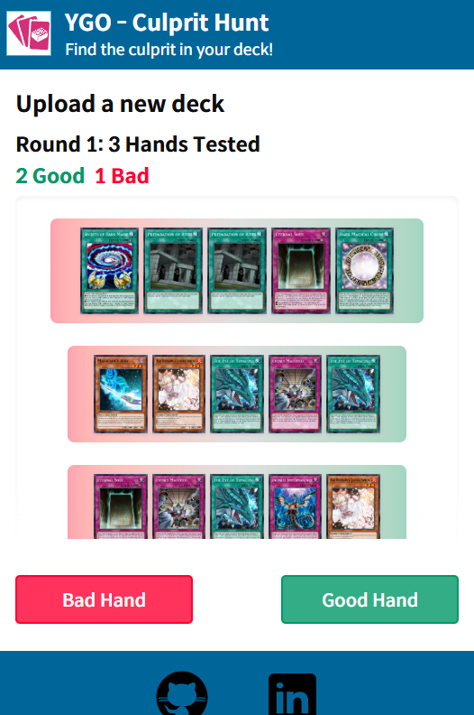

# YGO – Culprit Hunt

Quickly spot the “bricks” in your Yu-Gi-Oh! deck by evaluating simulated opening hands.

---



---

## Table of Contents

1. [Features](#features)
2. [Quick Start](#quick-start)
3. [Usage](#usage)
4. [Tech Stack](#tech-stack)
5. [Upcoming](#upcoming)
6. [License](#license)

---

## Features

-   Interactive hand testing: swipe or click to mark a 5-card hand as playable or brick
-   Iterative filtering: unsuitable cards re-enter the pool until culprits remain
-   Built-in sample: load the Dark Magician deck to try it instantly

---

## Try It Here!

[https://ygo-culprithunt.vercel.app/](https://ygo-culprithunt.vercel.app/)

### Backend

[Backend Repo](https://github.com/hynwkm/ygo-culprithunt-backend)

```bash
npm install
npm run dev
```

### Frontend

```bash
npm install
npm run dev
```

Then open your browser at:  
[http://localhost:5173](http://localhost:5173)

---

## Usage

1. Click **Upload Deck** and select a `.ydk` file, or pick the **Dark Magician** deck
2. You’ll see a row of 5 cards (your opening hand)
3. **Swipe right** (or click Good Hand) if the hand is playable
4. **Swipe left** (or click Bad Hand) if it’s a brick
5. “Brick” cards are reshuffled into the deck, and you repeat until only a few culprits remain
6. That's it! Adjust your deck list based on the identified culprits

---

## Tech Stack

### Frontend

-   React
-   Vite
-   Tailwind CSS
-   Framer Motion
-   react-swipeable
-   Axios
-   react-router-dom
-   clsx
-   tailwind-merge
-   uuid

### Backend

-   Fastify
-   TypeScript
-   node-cron
-   undici
-   dotenv
-   @fastify/cors

### External API

-   [YGOPRODeck API](https://ygoprodeck.com/api-guide/)  
    (Used for syncing card info once per month)

---

## Upcoming Features

1. Login system to save/edit/delete decks
2. Evaluate other players' public decks
3. Show which cards are most often tagged as bricks

---

## License

[MIT License](https://choosealicense.com/licenses/mit/)
